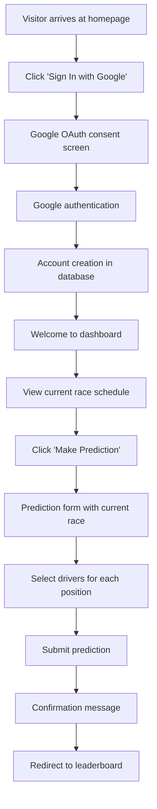
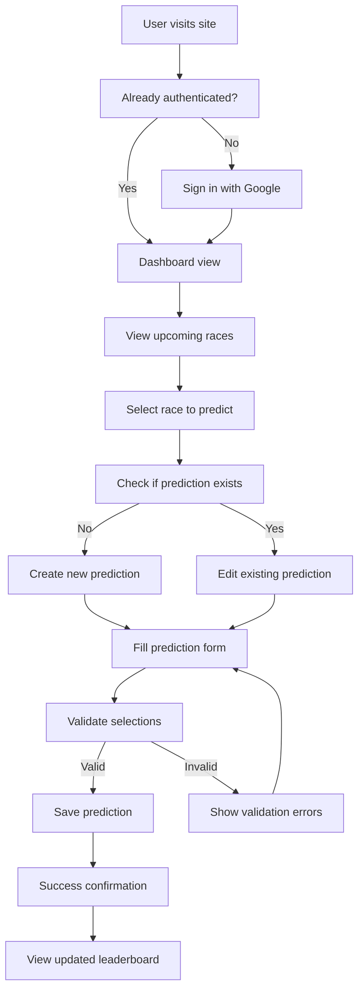
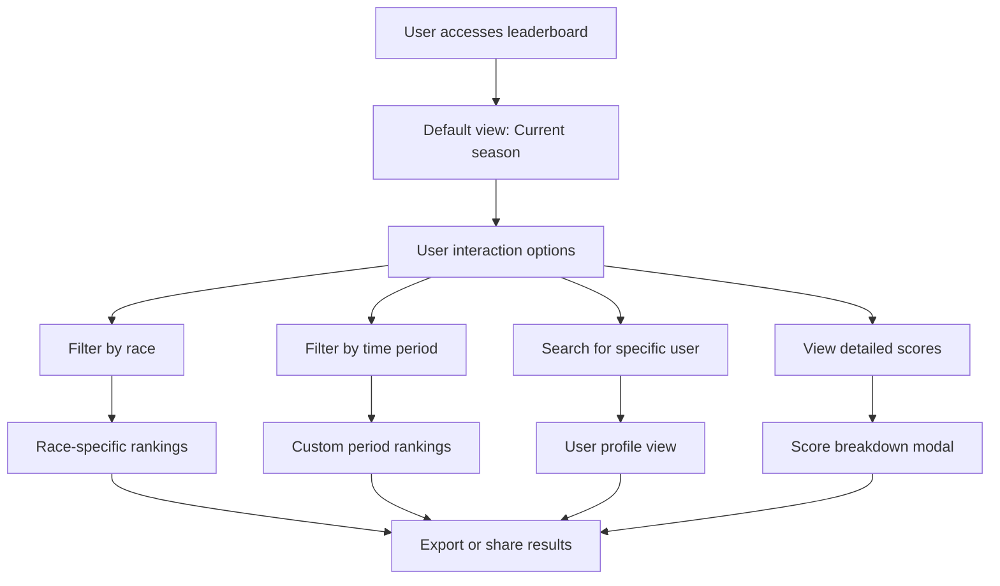
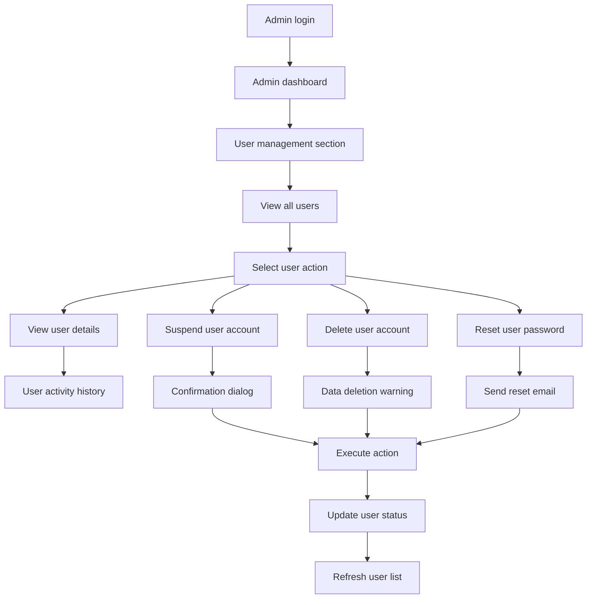
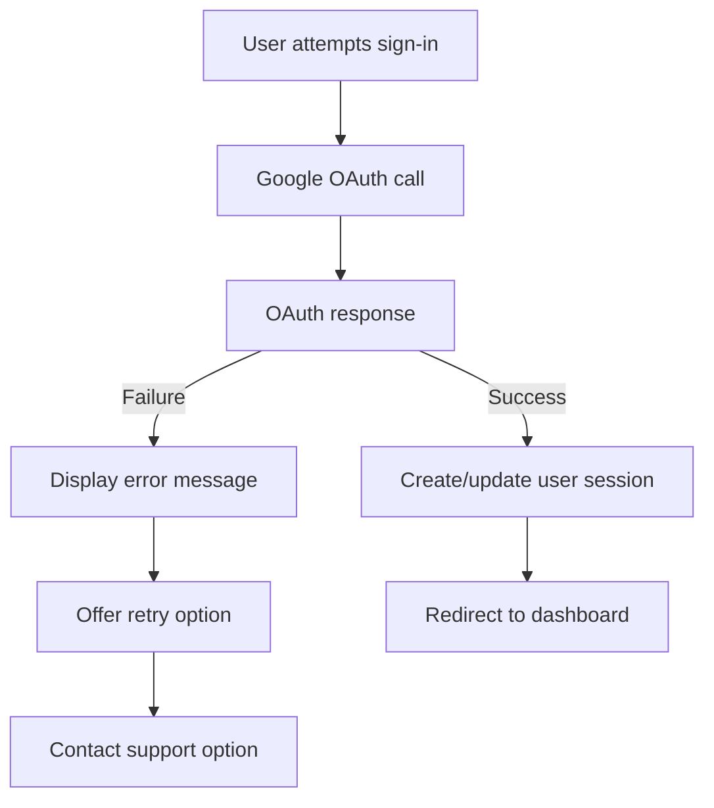
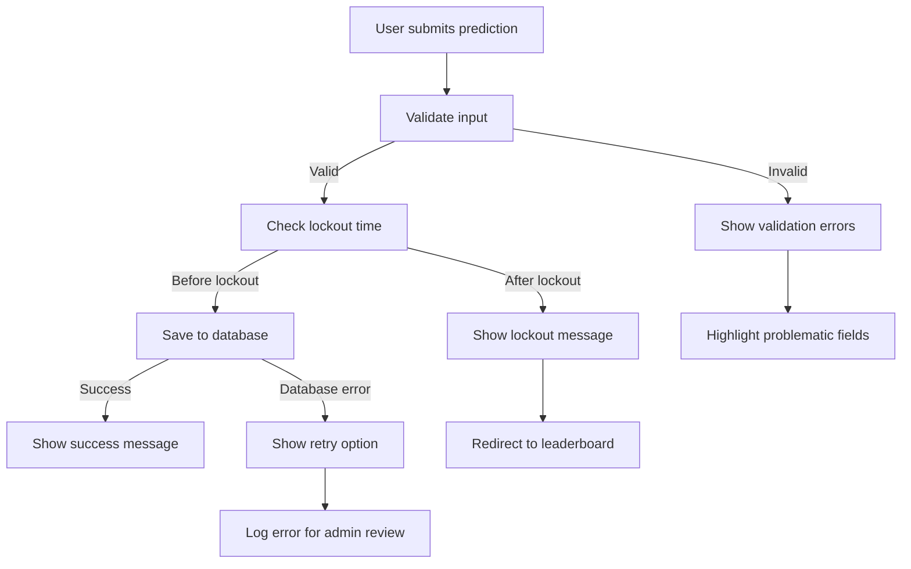
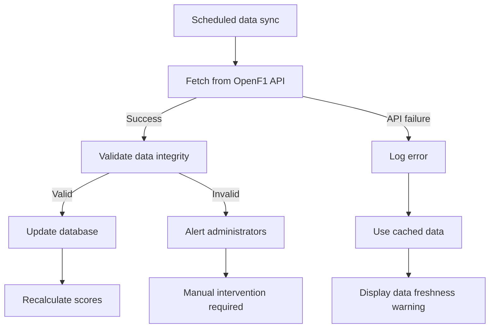

# F1 Penca - User Flow Documentation

## Primary User Flows

### 1. New User Registration & First Prediction

### 2. Returning User - Making Predictions

### 3. Leaderboard Viewing & Analysis

### 4. Admin User Management

## Detailed User Journeys

### First-Time User Experience

**Phase 1: Discovery & Registration**
1. User discovers F1 Penca through social media/friend referral
2. Lands on homepage with clear value proposition
3. Sees current F1 season information and sample leaderboard
4. Clicks "Get Started" or "Sign In with Google"
5. Completes Google OAuth flow
6. System creates user account automatically
7. User sees personalized welcome message

**Phase 2: Onboarding & First Prediction**
1. User guided to dashboard with tutorial tooltips
2. Current race weekend highlighted prominently
3. "Make Your First Prediction" call-to-action
4. Prediction form opens with helper text
5. User selects drivers for each position
6. Form validates selections in real-time
7. User submits first prediction successfully
8. Celebration animation and achievement unlock

**Phase 3: Engagement & Discovery**
1. User redirected to leaderboard view
2. Sees their position among other users
3. Discovers scoring system explanation
4. Explores historical race data
5. Checks upcoming race schedule
6. Sets up notification preferences

### Regular User Experience

**Pre-Race Preparation**
1. User receives notification about upcoming race
2. Logs in to check current predictions
3. Reviews race information and recent form
4. Adjusts predictions based on new information
5. Confirms final selections before lockout

**Post-Race Analysis**
1. User receives race completion notification
2. Checks updated scores and leaderboard position
3. Analyzes prediction accuracy
4. Views detailed scoring breakdown
5. Compares performance with friends
6. Prepares for next race predictions

### Admin User Experience

**Daily Administration**
1. Admin reviews system health dashboard
2. Checks for user reports or issues
3. Monitors data synchronization status
4. Reviews recent user activity patterns

**User Management Tasks**
1. Investigates reported user behavior
2. Reviews user's prediction history
3. Makes moderation decisions
4. Implements account actions as needed
5. Documents decisions for audit trail

**Data Management Tasks**
1. Monitors F1 data feed accuracy
2. Resolves data conflicts when they arise
3. Manually updates race results if needed
4. Verifies scoring calculations

## Error Handling Flows

### Authentication Failures

### Prediction Submission Errors

### Data Synchronization Issues

## Mobile User Experience

### Mobile-Specific Flows

**Touch-Optimized Prediction Making**
1. User opens app on mobile device
2. Sees mobile-optimized dashboard layout
3. Taps on current race card
4. Swipes through prediction categories
5. Uses dropdown selectors optimized for touch
6. Confirms predictions with large touch targets

**Mobile Navigation Patterns**
1. Bottom navigation bar for main sections
2. Swipe gestures for leaderboard filtering
3. Pull-to-refresh for data updates
4. Touch-friendly form controls

## Performance Considerations

### Optimized Loading Flows

**Progressive Data Loading**
1. Critical content loads first (current user data)
2. Leaderboard data loads progressively
3. Historical data loads on demand
4. Images and media lazy-load

**Offline Capability**
1. Core prediction data cached locally
2. Offline predictions saved temporarily
3. Sync when connection restored
4. Clear indicators of offline status

## Accessibility Flows

### Screen Reader Support

**Keyboard Navigation Paths**
1. Logical tab order through prediction forms
2. Skip links for main content areas
3. ARIA labels for complex interactions
4. Clear focus indicators throughout

**Voice Control Support**
1. Voice commands for common actions
2. Audio feedback for score updates
3. Screen reader announcements for dynamic content
4. Alternative navigation for motor impairments
